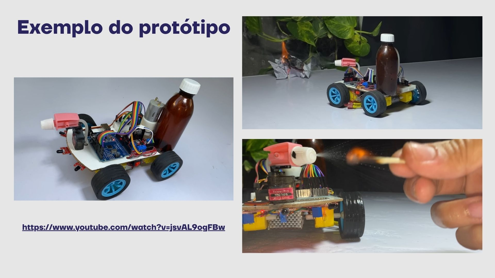

# 🤖 Robô Autônomo de Combate a Incêndio

Projeto de desenvolvimento de um robô autônomo capaz de detectar focos de incêndio e agir para combatê-los de forma eficiente e segura.

📋 Descrição

O Robô de Combate a Incêndio é um sistema projetado para localizar fontes de calor (chamas) e realizar manobras para extingui-las automaticamente.
Este projeto busca aplicar conceitos de robótica, eletrônica, automação e programação embarcada em um protótipo funcional.

⚙️ Funcionalidades

    🚒 Detecção de incêndios via sensores.

    🔥 Movimentação autônoma em direção à fonte do incêndio.

    💨 Sistema de combate, acionamento de extintor.

    🧠 Lógica de decisão simples para navegação e combate.

🔧 Tecnologias e Componentes Utilizados

    Microcontrolador (Arduino e ESP32, ESPCAM)

    Sensores de chama

    Módulos de motores DC ou servo motores

    Fonte de alimentação (baterias ligadas em série)

    Estrutura robótica (chassi, rodas, suportes)

    Módulos auxiliares (ex: driver de motor)
